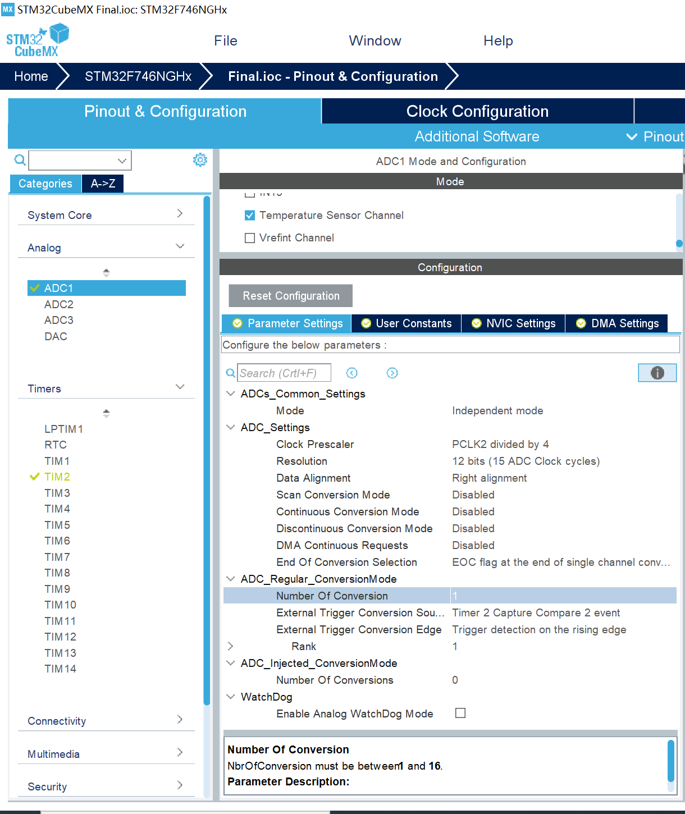
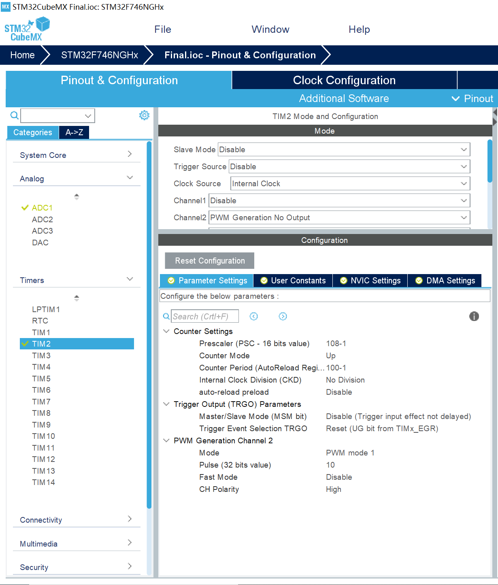
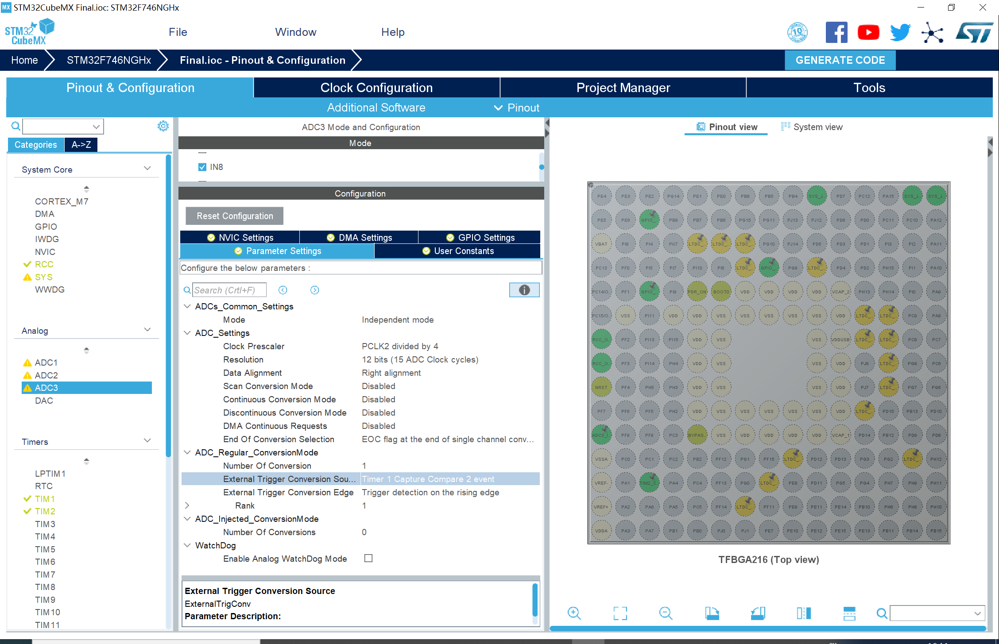
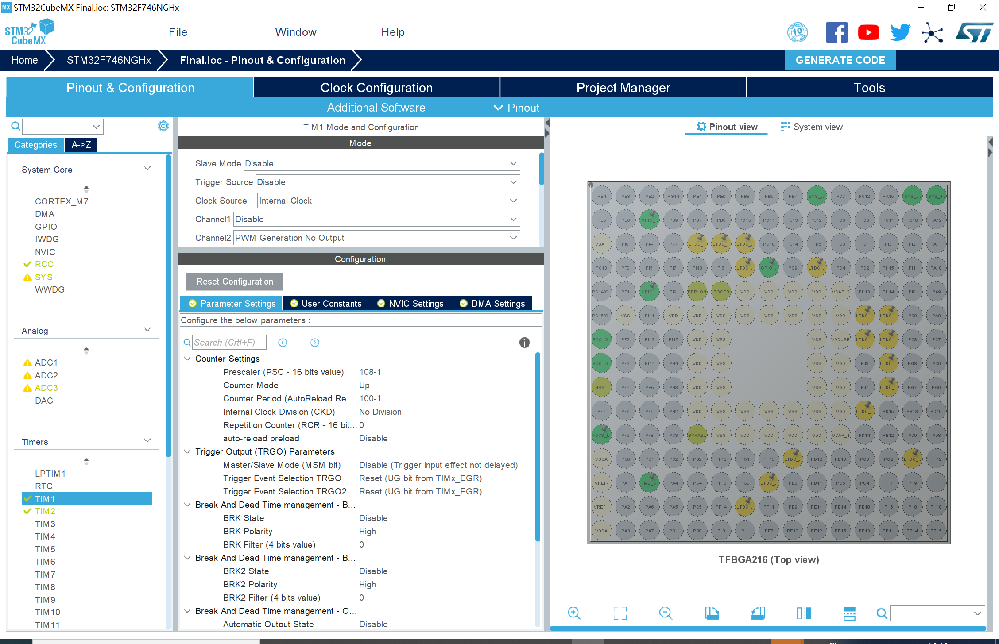
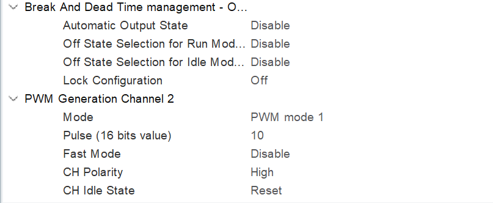
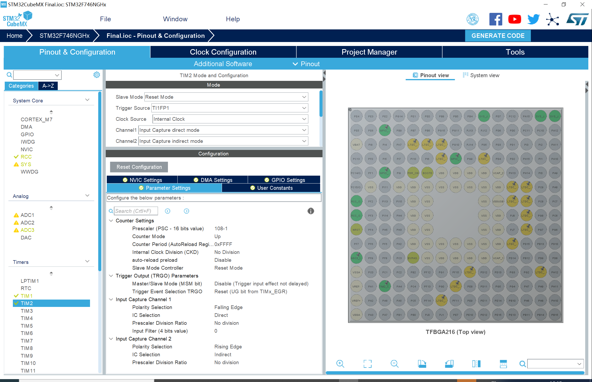
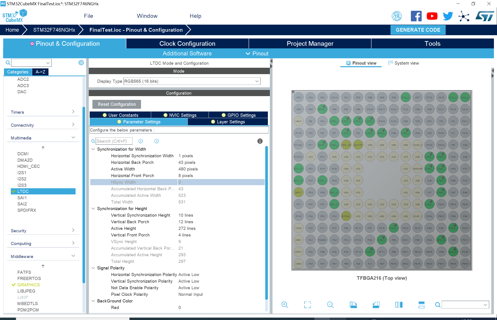
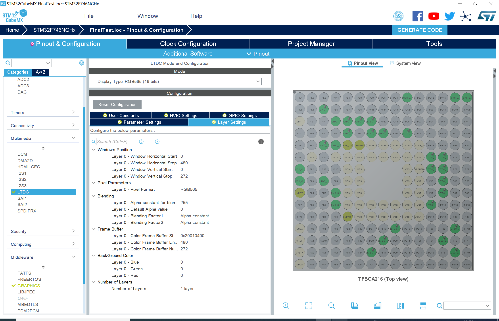
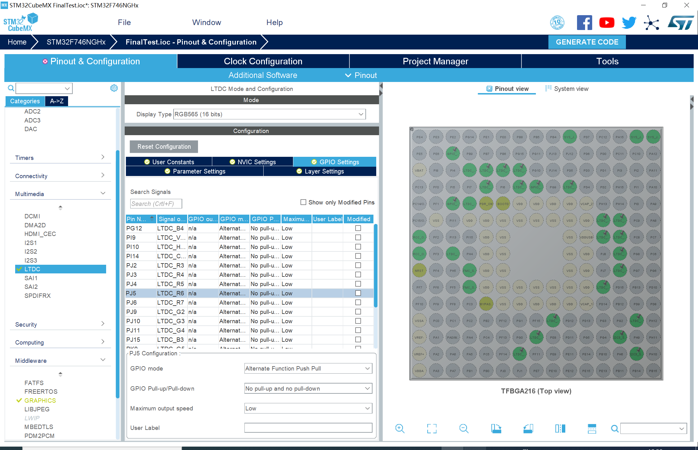
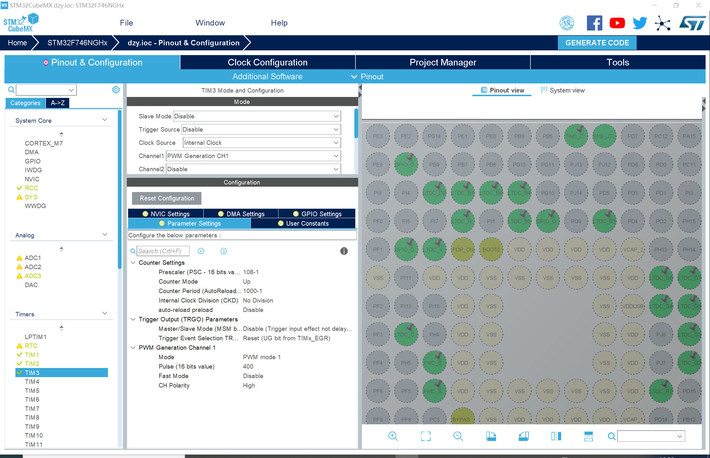

# 改动文件

`对main.c文件里面改动说明的一个简要提取，并加一些说明，以便于对于内容的重现`

## 2020.10.27改动说明——————高成鑫

### STM32CubeMax:

ADC1进行了初始化---------------配置使用TIM2作为外部时钟源，具体配置如Img文件夹下(图中未体现开启中断)所示 ,ADC可选择使用IN0外接模拟温度转换，或者Temperature使用内部温度转换

### IAR今日改动位置：

main.c:

       USER CODE BEGIN PD---------------1.添加了两个互斥的#define，在使用时根据使用的时外部的模拟温度转换模块还是内部的时钟做出选择
       USER CODE BEGIN PV---------------2.增添了在使用IN0或内部温度测量时使用的全局变量
       USER CODE BEGIN 0----------------3.使用IN0和IN18时候的回调函数重写，他们的主要区别在于AD读数不同从而公式不同，还有，该公式正确性待检验
       USER CODE BEGIN 2----------------4.开启定时器TIM2以及ADC的中断（两个IN口都会使用）

### 其他说明：

缩进的printf表示调试过程中查看变量使用的，在正式使用中要被注释掉

## 2020.10.28改动说明

### 遇到的问题

在同时使用ADC采集温度信号和使用红外接收模块时候，会产生红外信号接受不完全的情况，试图提高红外接收模块的中断优先级，看看效果怎么样。（并没有什么nuan用）最后的解决是注释掉了所有的printf，（顺带的修改了TIM2和ADC的中断优先级）。

### STM32CubeMax修改

ADC更改 ADC1IN0改ADC3IN8

       为了便于实时测量温度，使用了外部的模拟温度传感器，不再使用IN18的temperature传感器，删除了相关的程序,将外部传感器的插口进行了更改，现在使用ADC3的IN8口作为输入，（对应扩展板上的A1位置），现在使用TIM1作为比较时钟

TIM1用作外部触发中断源External Trigger Conversion Source

       配置同之前的TIM2相同
       
TIM2更改

       现在将TIM2作为输入捕获使用，chanal1 chanal2分别为主从模式，用于捕获下降沿和上升沿
       
相关的配置情况如Image文件夹中、、、所示

### IAR今日改动位置

main.c:

       USER CODE BEGIN PV---------------1.增添了在输入捕获时候使用的全局变量
       USER CODE BEGIN 0----------------2.输入捕获的回调函数
       USER CODE BEGIN 2----------------3.开启定时器TIM2通道1和2输入捕获的中断（最终使用的只有TIM2 Channal1的中断）
其他说明：
       缩进的printf表示调试过程中查看变量使用的，在正式使用中要被注释掉

## 2020.10.29改动说明——————孙天一

### STM32CubeMax

       FMC、CRC模块功能开启------------为开启STemWin做准备，无需更多配置
       LTDC模块功能开启---------------开启液晶屏控制器LTDC，为节省内存使用RGB565，场同步、行同步、前向纠错时间、后向纠错时间等根据手册配置相关参数，修改GPIO口，如图所示
       Graphics功能开启---------------使用STemWin绘制窗口，使用PG13，设置为Output模式作为LCD的复位管教，由STemWin来接管，其他配置如20201029_130312_Graphics.png所示
       I2C功能开启--------------------使用I2C总线来控制屏幕触摸，修改板上I2C3对应的GPIO口，PH7为SCL，PH8为SDA，设置为快速模式

、、

### IAR今日改动位置

```
main.c:
       USER CODE BEGIN PFP--------------1.触碰检测函数的声明，
       USER CODE BEGIN 0----------------2.触碰检测函数的定义，向触摸屏驱动传递坐标
                                        checkTouch[]是触摸点位置的数组，ch[0]为触点个数，ch[2] ch[3]为y坐标，ch[4] ch[5]为x坐标
GUI_App.c:
       USER CODE BEGIN GRAPHICS_MainTask-----1.将原来的Hello World程序注释掉，将while(1)循环提前，在里面写如触摸检测程序
WindowDLG.c:
       USER START (Optionally insert additional static code)----1.定义的设置风速、温度、模式的全局变量
       对三个按钮Button0~3触碰的回调函数编写
其他说明：
       缩进的printf表示调试过程中查看变量使用的，在正式使用中要被注释掉
       变量名大写的表示字符串，小写的表示普通变量
```

## 2020.10.30改动说明——————高成鑫

STM32CubeMax:

       TIM3_CH2、TIM12_CH1、TIM12_CH2开启-----设置为PWM输出模式，预分频器与技术周期设置为108-1与1000-1,使频率为1KHz，Pulse黄灯初始值设置为400，红蓝为0 如图所示，修改对应GPIO口



IAR今日改动位置：

```
main.c:
       USER CODE BEGIN PTD--------------1.对开关状态的宏定义，用于对于红外命令较多时候的便于识别
       USER CODE BEGIN PV---------------2.对开关状态的定义，对温度设定、风速设定、模式设定的外部定义引入
       USER CODE BEGIN 2----------------3.开启两个定时器的三个Channel口PWM输出
       USER CODE BEGIN 0----------------4.在2020.10.28-2的红外中断函数中，加入了对红外解码的处理，可以使用遥控器控制开关机、风速、温度、空调工作模式
WindowDLG.c:
       USER START (Optionally insert additional message handling)----1.在RTC时钟的回调函数里面，添加根据风速、温度设置对LED指示灯改变的命令，实现空调变频。在RTC的回调函数中，添加对空调开关状态的处理，通过改变PK3的电平状态实现，刷新温度、风速、模式显示
其他说明：
       缩进的printf表示调试过程中查看变量使用的，在正式使用中要被注释掉
       变量名大写的表示字符串，小写的表示普通变量
```
